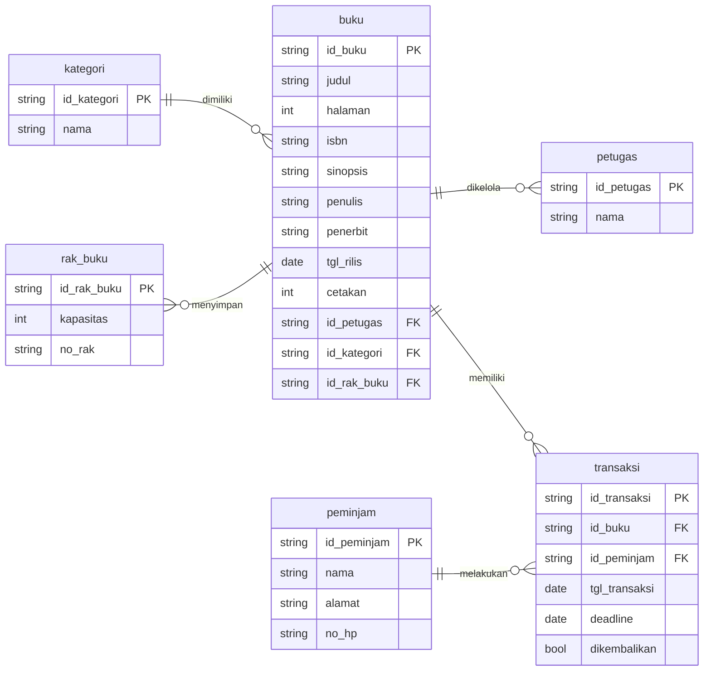

# Perpustakan - ERD

This project was made by Muhammad Davinda Rinaldy in Training Program held by Kodacademy to make ERD of a library, using mermaid tool.

## Entity Relationship Diagram (ERD)

```mermaid
erDiagram
    direction LR
    buku {
        string id_buku PK
        string judul
        int halaman
        string isbn
        string sinopsis
        string penulis
        string penerbit
        date tgl_rilis
        int cetakan
        string id_petugas FK
        string id_kategori FK
        string id_rak_buku FK
    }
    kategori {
        string id_kategori PK
        string nama
    }
    rak_buku {
        string id_rak_buku PK
        int kapasitas
        string no_rak
    }
    petugas {
        string id_petugas PK
        string nama
    }
    peminjam {
        string id_peminjam PK
        string nama
        string alamat
        string no_hp
    }
    transaksi {
        string id_transaksi PK
        string id_buku FK
        string id_peminjam FK
        date tgl_transaksi
        date deadline
        bool dikembalikan
    }
    kategori ||--o{ buku: dimiliki
    rak_buku }o--|| buku: menyimpan
    buku ||--o{ petugas: dikelola
    buku ||--o{ transaksi: memiliki
    peminjam ||--o{ transaksi: melakukan
```
